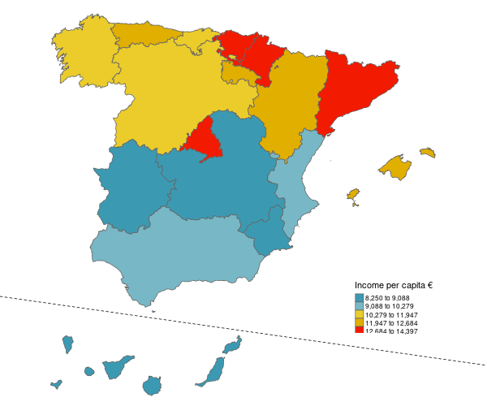
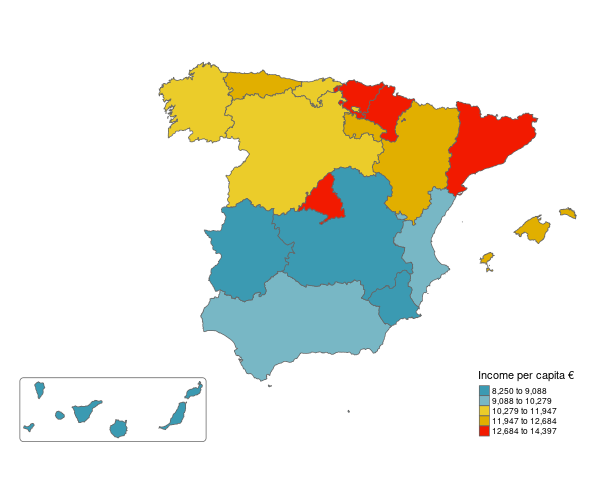
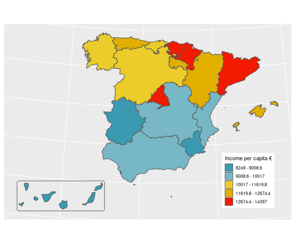

Alternative layout for maps of Spain
================

This repo shows three approaches to create an inset map of Spain, which
shows the Canary Islands and ensures that relative sizes are preserved.

## Code

[The first
approach](https://github.com/Nowosad/spain-map-layout/blob/master/R/01_first_approach.R)
uses the [**tmap**](https://github.com/mtennekes/tmap) package and a
ratio between the Spain continental territory and Canary Island to plot
both on a
map.

[The second
approach](https://github.com/Nowosad/spain-map-layout/blob/master/R/02_second_approach.R)
uses the [**tmap**](https://github.com/mtennekes/tmap) package and moves
geometries representing Canary Island closer to the Spain continental
territory.

[The third
approach](https://github.com/Nowosad/spain-map-layout/blob/master/R/03_third_approach.R)
uses the [**ggplot2**](https://ggplot2.tidyverse.org/) package and moves
geometries representing Canary Island closer to the Spain continental
territory.

## Data

Spatial data allowing for alternative visualizations of Spain using the
second approach is available in:

  - [GeoPackage
    format](https://github.com/Nowosad/spain-map-layout/raw/master/data/spain_data.gpkg)
  - [ESRI Shapefile
    format](https://github.com/Nowosad/spain-map-layout/raw/master/data/spain_data.zip)
  - [RDS
    format](https://github.com/Nowosad/spain-map-layout/raw/master/data/spain_data.rds)

## Acknowledgements

Created maps were inspired by <https://github.com/aaumaitre/maps_Spain>,
<https://github.com/aaumaitre/maps_Spain/issues/1#issue-513198322>, and
the visualizing geospatial data chapter of [the Fundamentals of Data
Visualization
book](https://serialmentor.com/dataviz/geospatial-data.html).

Read [the Geocomputation with R
book](https://geocompr.robinlovelace.net/) to learn more about spatial
data operations and visualizations.
